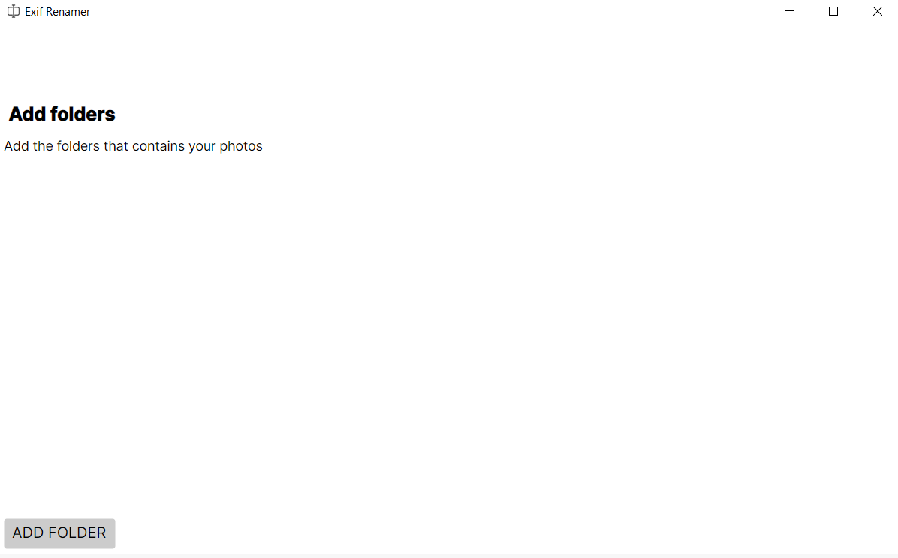
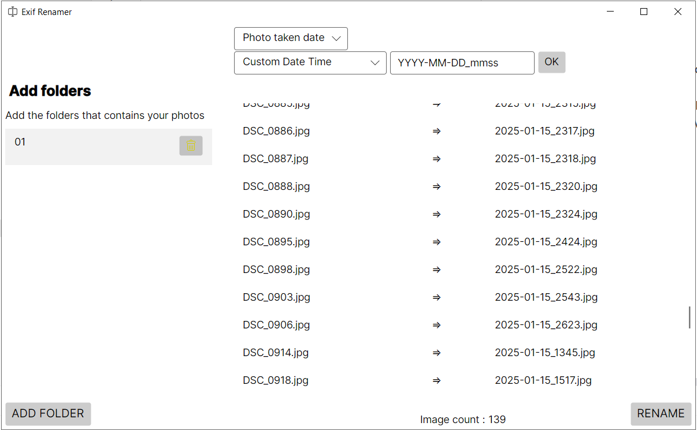
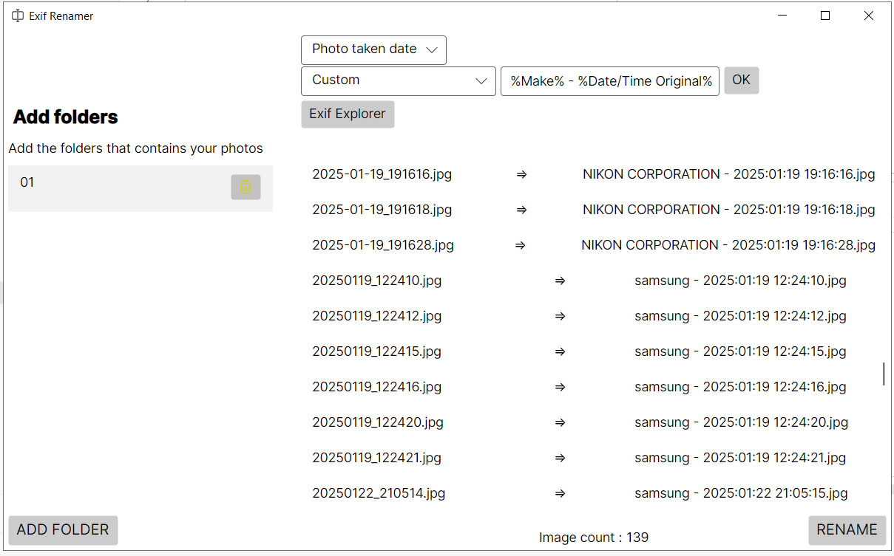

# Exif Renamer

Exif Renamer is a cross-platform tool for renaming files based on their EXIF data. It is designed to be simple, intuitive and easy to use, with a focus on speed and efficiency. The tool is built using C# and Avalonia UI. 
It is available for Windows, Linux and MacOS. The tool is open source and licensed under the MIT license.

## Screenshots




The tool is under active development. Any contribution is appreciated. If you find any bugs or have any feature requests, please open an issue on the GitHub repository.


## Landing page

The static product website lives in `docs/` and uses plain HTML, CSS and
JavaScript. Preview it without building the desktop application:

```shell
python -m http.server 8080 --directory docs
```

Then open `http://localhost:8080`. The illustrative screenshots are the three
`docs/assets/screenshot-*.svg` files; replace them while keeping the same file
names, or update the paths in `docs/assets/app.js`.

Changes limited to `docs/` deploy through the `Deploy landing page` workflow and
are ignored by the desktop build. In the repository settings, configure GitHub
Pages to use **GitHub Actions** as its source.

## Distribution

GitHub Actions builds installable and portable packages for every push and pull
request targeting `master`:

- Windows x64: per-user NSIS installer and portable ZIP;
- macOS Intel and Apple Silicon: `.app` bundle distributed as DMG and ZIP;
- Linux x64: Debian package and portable TAR.GZ.

Create and push a semantic version tag to publish these packages in a GitHub
Release:

```shell
git tag v1.0.0
git push origin v1.0.0
```

Release tags must use the exact `vMAJOR.MINOR.PATCH` format. The tag supplies the
application and package version. SHA-256 checksums are attached to each release.

### Signing status

The free distribution pipeline does not establish a verified publisher identity:

- the Windows executable and NSIS installer are unsigned, so Microsoft Defender
  SmartScreen can show an unknown-publisher warning;
- macOS bundles use an ad-hoc signature for bundle integrity, but they are not
  signed with an Apple Developer ID or notarized. Gatekeeper can therefore require
  the user to explicitly approve the first launch;
- Linux packages are currently unsigned and are intended for direct download from
  the GitHub Release together with its checksums.

Certificates and notarization credentials must never be committed. When signing
is added, store them as protected GitHub Actions environment secrets and expose
them only to tag-triggered release jobs.

The scripts under `packaging/` deliberately use native or open-source tooling and
do not require an Avalonia Parcel CLI license. `ExifRenamer.parcel` remains useful
for local Parcel usage but is not read by the CI workflow.
