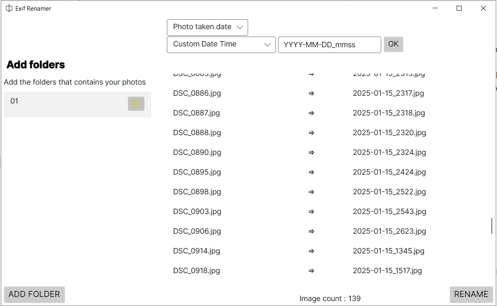
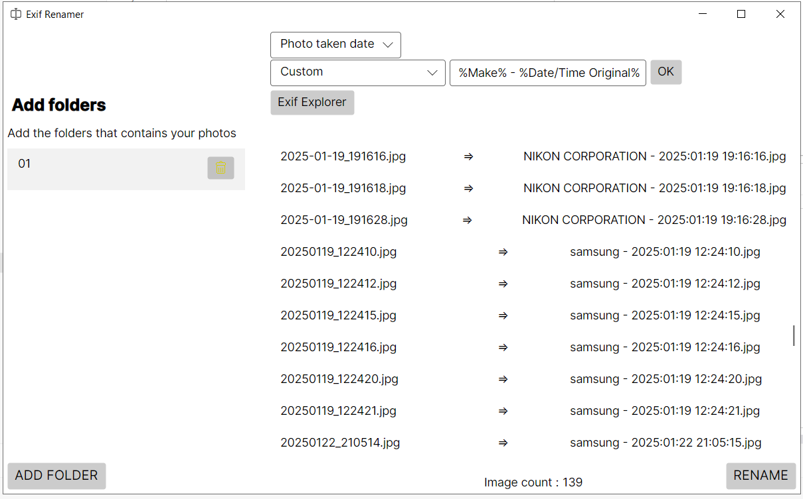

# Exif Renamer

Exif Renamer is a cross-platform tool for renaming files based on their EXIF data. It is designed to be simple, intuitive and easy to use, with a focus on speed and efficiency. The tool is built using C# and Avalonia UI. 
It is available for Windows, Linux and MacOS. The tool is open source and licensed under the MIT license.

## Screenshots

The tool is under active development. Any contribution is appreciated. If you find any bugs or have any feature requests, please open an issue on the GitHub repository.
